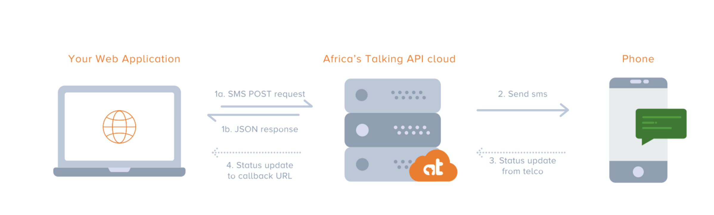

# AfricaTalkSmsService

## SMS

There is a SDK that provides convenient access to the Africa's Talking API from applications written in Java.
Dependency on jar through gradle
```aidl
repositories {
  maven {
    url  "http://dl.bintray.com/africastalking/java"
  }
}

dependencies{
  compile 'com.africastalking:core:3.4.2'
}
```  
The SDK needs to be initialized with your app username and API key, which you get from the here https://account.africastalking.com/
```aidl
String username = "YOUR_USERNAME";    
String apiKey = "YOUR_API_KEY";      
AfricasTalking.initialize(username, apiKey);
SmsService sms = AfricasTalking.getService(AfricasTalking.SERVICE_SMS);
List<Recipient> response = sms.send("Hello Message!", new String[] {"+2547xxxxxx"}, true);
```

Africa talk Sandbox is used for sms and ussd service and those can ve created using below links:
 
Service Code for ussd can be created from:
https://account.africastalking.com/apps/sandbox/ussd/codes

SMS - Short Code can be created from:
https://account.africastalking.com/apps/sandbox/sms/shortcodes

```
Response for the sms sent with the sdk :
{ Number : +254739495441
  Cost : KES 0.8000 
  Status : Success 
  MessageId : ATXid_c4bdd23b12ad66c9a48cc1ed783da85f 
}
{ Number : +254739496441
  Cost : KES 0.8000 
  Status : Success 
  MessageId : ATXid_800aee138beca45c17741e96a4d00423 
} 
```
## USSD
### API parameters
The API makes a HTTP POST request to your server with parameters shown below. This request is made when the user dials a USSD code and every time they respond to a menu.

Parameter	( All string )
- sessionId	
- phoneNumber 
- networkCode
- serviceCode 
- text 


ngrok can be used to point to local repo instance for ussd, in this case e72e57903a78.in.ngrok.io is pointing to localhost:8080

Raw post request for received for ussd:
```POST / HTTP/1.1
Host: e72e57903a78.in.ngrok.io
User-Agent: at-ussd-api/1.0
Content-Type: application/x-www-form-urlencoded; charset=UTF-8
Content-Length: 130
X-Forwarded-For: 134.213.151.223

phoneNumber=%2B254739495441&serviceCode=%2A384%2A44135%23&text=&sessionId=ATUid_7c898d72eb11f723ed8ea05ef232f279&networkCode=99999
```
